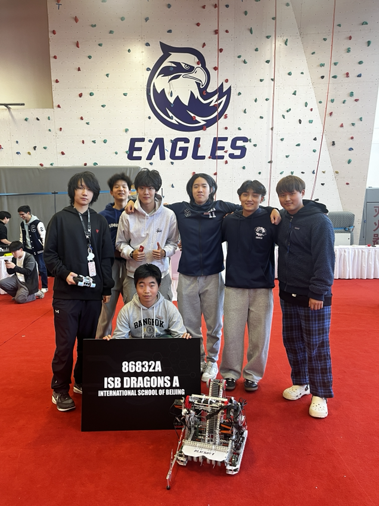
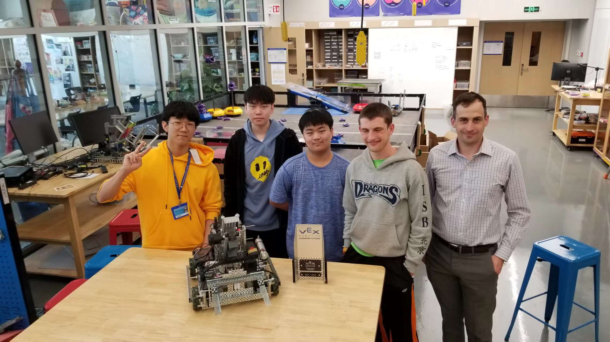

# Bobo & Co. (86832A)

Competition & Awards History

* 2019 TIS Robotics Challenge: [Create Award](https://www.robotevents.com/robot-competitions/vex-robotics-competition/RE-VRC-18-6440.html#awards), [Finalist](https://www.robotevents.com/robot-competitions/vex-robotics-competition/RE-VRC-18-6440.html#results-)
* 2022 TIS Robotics Challenge: [Innovate Award](https://www.robotevents.com/robot-competitions/vex-robotics-competition/RE-VRC-22-7401.html#awards)
* 2023 ISB Robotics Scrimmage: Finalist
* 2024 TIS Robotics Challenge: [Amaze Award](https://www.robotevents.com/robot-competitions/vex-robotics-competition/RE-VRC-23-2772.html#awards)
* 2024 Trial APAC Robotics Tournament (SASPD): Judges Award
* 2024 ISB Robotics Scrimmage: Tournament Champion
* 2025 ACAMIS North Tournament (Regional): [Tournament Champion](https://www.robotevents.com/robot-competitions/vex-robotics-competition/RE-V5RC-24-9429.html#awards)
* 2025 ACAMIS National Championship: [Think Award](https://www.robotevents.com/robot-competitions/vex-robotics-competition/RE-V5RC-24-9438.html#awards)
* 2026 YHIS Robotics Challenge Tournament Semifinalist: [Tournament Semifinalists](https://www.robotevents.com/robot-competitions/vex-robotics-competition/RE-V5RC-25-3132.html#awards)

## Member History

### 2025-2026 Push Back (Team name: Bobo & Co.):

* Finn Clayton (Team Captain)
* Bowen Ke
* Lucas Yu
* William Wang
* James Chen
* Hajin Roh
* Imran Abdulkhakov

### 2024-2025 High Stakes:

<figure><figcaption>
86832A at the TIS Robotics Challenge ( L to R: Leon Zhu, Lucas Yu, James Chen, Andrew Gong, Hajin Roh, Bowen Ke, Ewan Koh)
</figcaption></figure>

* Leon Zhu (Team Captain)
* Ryan Quon
* Bowen Ke
* Lucas Yu
* Hajin Roh
* David Yao
* Silas Wang
* Andrew Gong
* Ewan Koh
* _Sinan Tuncer_
* _James Chen_

### 2023-2024: Over Under

* Ryan Quon
* Bowen Ke
* Hajin Roh
* Xiatian Liu
* Leon Zhu

### 2022-2023: Spin Up

* Ryan Quon
* Bowen Ke
* Jiyuan Li

### 2021-2022: Tipping Point

<figure><figcaption>
86832A 2021-2022: (Left to right: Myungjun Lee, Seongjoon, George Xu, Silas Brock, Tyler Beatty)
</figcaption></figure>

* Silas Brock
* Myungjun Lee
* George Xu
* Seongjoon
* _Sara_
* _Minseo_
* _Jonathon_
* _Peter_
* _Haozhe Liu_

### 2019-2020 Tower Takeover (Team name: Dragon's Gate):

<figure><figcaption>
86832A 2019-2020 Group Photo
</figcaption></figure>

* Vanessa Quon
* Minhye Kwon
* Haozhe Liu
* Susan ?
* Akshat ?
* Austin ?
* Celina Zhao
* James Huang

### 2018-2019 Turning Point:

* Aiki De Peralta
* ~~Jaewon Jung~~
* Victor Ren
* Arthur Wang
* Austin Zeng
* Bono Yoo
* Sunmin Yeou
* Hye Inn Eric Lim
* ~~Kyeongdo James Lee~~
