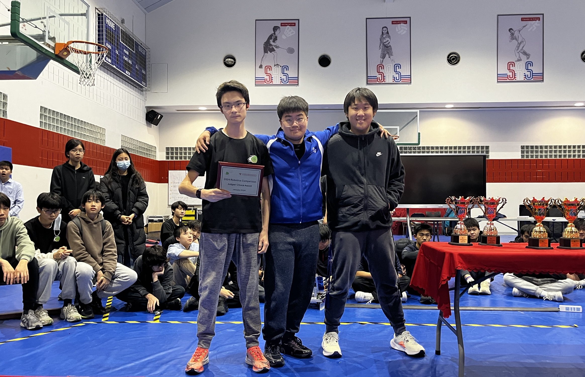

# 86832D

## Competition & Awards History

* 2023 ISB Robotics Scrimmage: Finalist
* 2024 Trial APAC Robotics Tournament (SASPX): Semi-Finalist, Judges Award, 4th Place
* 2024 TIS Robotics Challenge: [Innovate Award](https://www.robotevents.com/robot-competitions/vex-robotics-competition/RE-VRC-23-2772.html#awards)
* 2025 ACAMIS North Tournament (Regional): Excellence Award, Finalist
* 2025 ACAMIS National Championship: Create Award

## Member History

### 2024-2025 High Stakes:

<figure><figcaption>
86832D at the ACAMIS North Region Tournament (L to R: Leo Liu, Jay Hong, Gillian Cao, Nathan Yu, Samuel Yao, Jihoon Moon, Eunseong Sim, Hyun Lee)
</figcaption></figure>

* Samuel Yao
* Lucas Duan
* George Xu&#x20;
* Gillian Cao
* Jay Hong
* Jihoon Moon
* Patrick Wang
* Leo Liu
* Nathan Yu
* Eunseong Sim
* Yolanda Mao
* Minghon Li
* Hyun Lee
* _James Park_
* _Leo Allison_

### 2023-2024 Over Under:&#x20;

<figure><figcaption>
2023-2024 Trial APAC Challenge. (From Left to Right: William Pan, George Xu, Lucas Duan)
</figcaption></figure>

* Samuel Yao _(Semester 1)_
* George Xu
* Lucas Duan
* William Pan

### 2019-2020 Tower Takeover:

* Aiki De Peralta
* Michael
* Daniel
* Derek
* Henry
