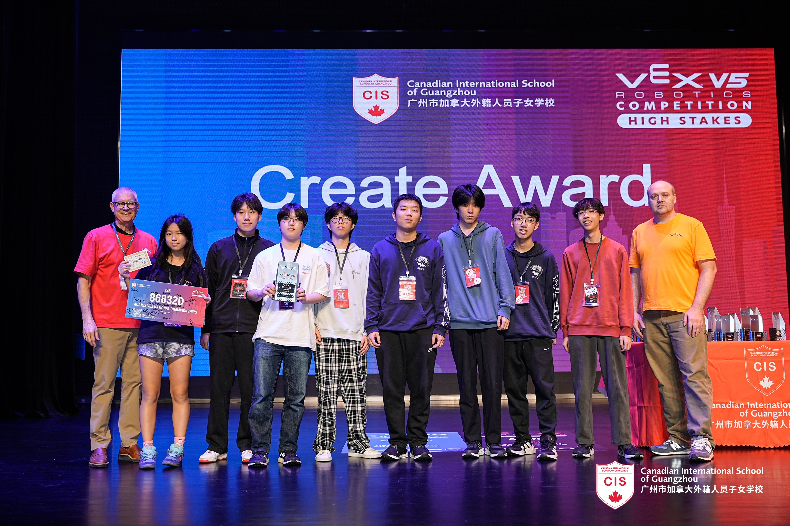

# Samuel (86832D)

## Competition & Awards History

* 2023 ISB Robotics Scrimmage: Finalist
* 2024 Trial APAC Robotics Tournament (SASPX): Semi-Finalist, Judges Award, 4th Place
* 2024 TIS Robotics Challenge: [Innovate Award](https://www.robotevents.com/robot-competitions/vex-robotics-competition/RE-VRC-23-2772.html#awards)
* 2025 ACAMIS North Tournament (Regional): [Excellence Award](https://www.robotevents.com/robot-competitions/vex-robotics-competition/RE-V5RC-24-9429.html#awards), Finalist
* 2025 ACAMIS National Championship: [Create Award](https://www.robotevents.com/robot-competitions/vex-robotics-competition/RE-V5RC-24-9438.html#awards)

## Member History

### 2025-2026 Push Back (Team name: Samuel):

* Jihoon Moon
* Leo Liu
* Eunseong Sim
* Patrick Wang

### 2024-2025 High Stakes:

<figure><figcaption>
86832D at the ACAMIS North Region Tournament (L to R: Leo Liu, Jay Hong, Gillian Cao, Nathan Yu, Samuel Yao, Jihoon Moon, Eunseong Sim, Hyun Lee)
</figcaption></figure>

<figure><figcaption>
86832D at ACAMIS Nationals (L to R: Gillian Cao, James Park, Eunseong Sim, Hyun Lee, Samuel Yao, Nathan Yu, Jay Hong, Jihoon Moon)
</figcaption></figure>

* Samuel Yao (Team Captain)
* Jihoon Moon
* Leo Liu
* Jay Hong
* Gillian Cao
* Nathan Yu
* Patrick Wang
* Eunseong Sim
* Hyun Lee
* George Xu (Semester 1)
* Lucas Duan (Semester 1)
* _Yolanda Mao (Contributor)_
* _Minghon Li (Contributor)_
* _James Park (Contributor)_
* _Leo Allison (Contributor)_
* _Jake Baek (Contributor)_

### 2023-2024 Over Under:&#x20;

<figure><figcaption>
2023-2024 Trial APAC Challenge. (From Left to Right: William Pan, George Xu, Lucas Duan)
</figcaption></figure>

* Samuel Yao _(Semester 1)_
* George Xu
* Lucas Duan
* William Pan

### 2019-2020 Tower Takeover (Yellow Team):

* Aiki De Peralta
* Michael
* Daniel
* Derek
* Henry
