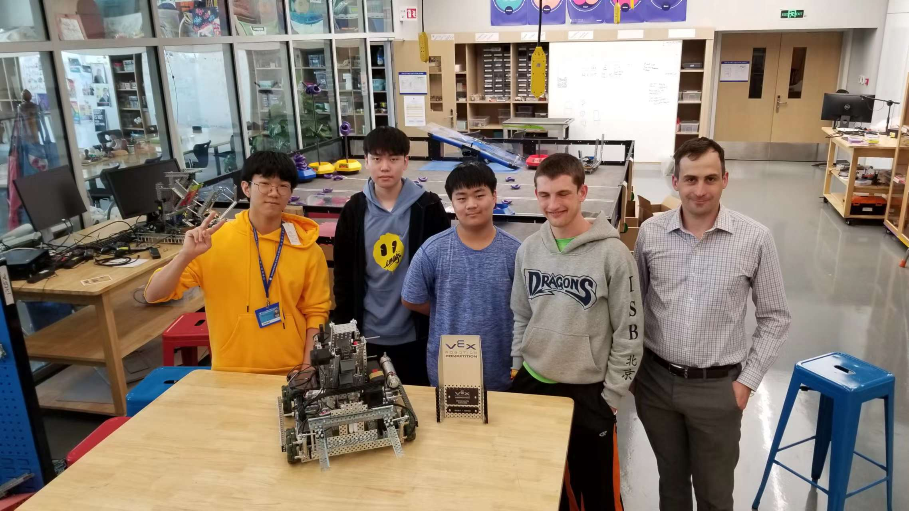

# 86832A

Competition & Awards History

* 2019 TIS Robotics Challenge: [Create Award](https://www.robotevents.com/robot-competitions/vex-robotics-competition/RE-VRC-18-6440.html#awards), [Finalist](https://www.robotevents.com/robot-competitions/vex-robotics-competition/RE-VRC-18-6440.html#results-)
* 2022 TIS Robotics Challenge: [Innovate Award](https://www.robotevents.com/robot-competitions/vex-robotics-competition/RE-VRC-22-7401.html#awards)
* 2023 ISB Robotics Scrimmage: Finalist
* 2024 TIS Robotics Challenge: [Amaze Award](https://www.robotevents.com/robot-competitions/vex-robotics-competition/RE-VRC-23-2772.html#awards)

## Member History

### 2023-2024: Over Under

* Ryan Quon
* Bowen Ke
* Hajin Roh
* Xiatian Liu
* Leon Zhu

### 2022-2023: Spin Up

*

### 2021-2022: Tipping Point

<figure><figcaption>
86832A 2021-2022: (Left to right: Myungjun Lee, Seongjoon, George Xu, Silas Brock, Tyler Beatty)
</figcaption></figure>

* Silas Brock
* Myungjun Lee
* George Xu
* Seongjoon

### 2019-2020 Tower Takeover:

* Vanessa Quon
* Minhye
* Haozhe
* Susan
* Akshat
* Austin
* Celina

### 2018-2019 Turning Point:

* Aiki De Peralta
* Jaewon Jung
* Victor Ren
* Arthur Wang
* Austin Zeng
* Bono Yoo
* Sunmin Yeou
* Hye Inn Eric Lim
