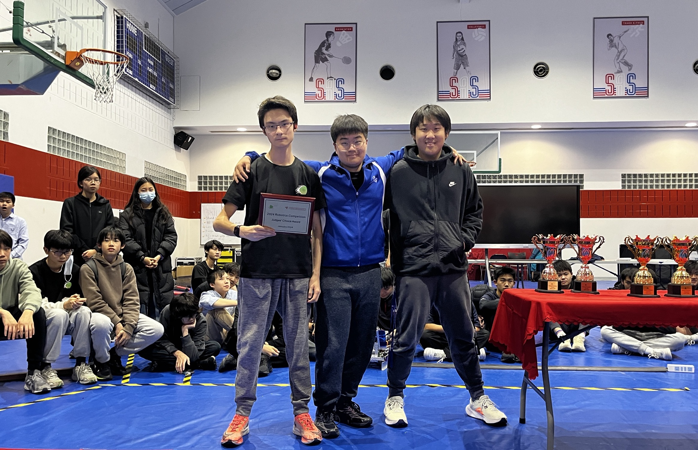

# 86832D

## Competition & Awards History

* 2023 ISB Robotics Scrimmage: Finalist
* 2024 Trial APAC Robotics Tournament: Semi-Finalist, Judges Award, 4th Place
* 2024 TIS Robotics Challenge: [Innovate Award](https://www.robotevents.com/robot-competitions/vex-robotics-competition/RE-VRC-23-2772.html#awards)

## Member History

2023-2024: Over Under

<figure><figcaption>
2023-2024 Trial APAC Challenge. (From Left to Right: William Pan, George Xu, Lucas Duan)
</figcaption></figure>

* Samuel Yao _(Semester 1)_
* George Xu
* Lucas Duan
* William Pan

<figure><figcaption>
2023-2024 Team D in TIS Competition. (From Left to Right: William Pan, Lucas Duan, George Xu)
</figcaption></figure>
