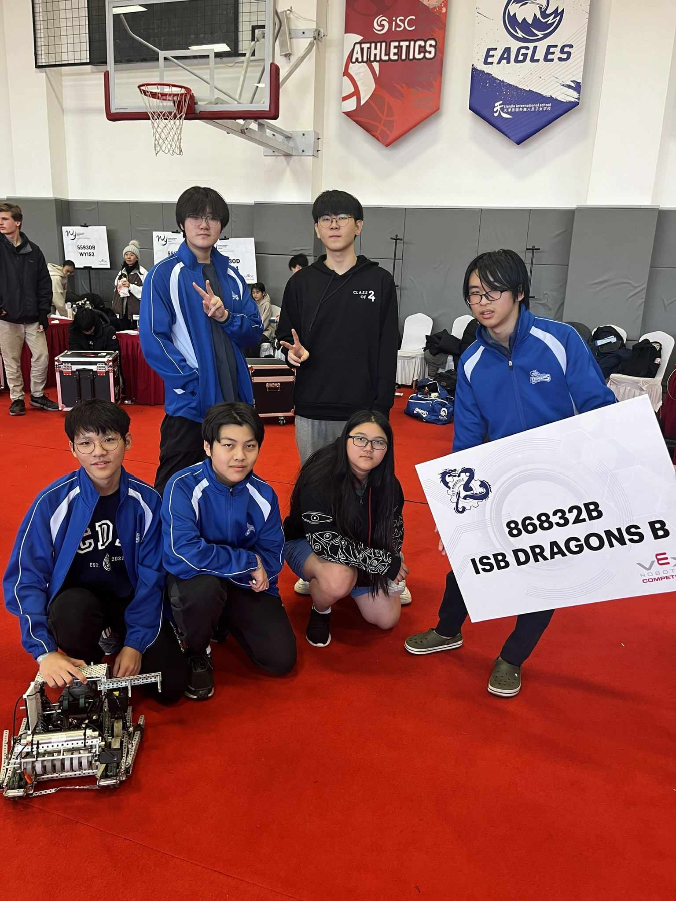

# 86832B

## Competition & Awards History

## Member History

### 2023-2024 Over Under:

<figure><figcaption>
86832B at the TIS Robotics Challenge (L-R, Top: Peter Kim, Taylor Kim, Bottom: Jeff Kwak, Eddie Xu, Petrina Aw Yong, Peter Wang) 
</figcaption></figure>

* Eddie Xu
* Geoffrey Liu
* Jeff Kwak
* Peter Kim
* Peter Wang
* Petrina Aw Yong
* Robin Wills
* Taylor Kim

### 2022-2023 Spin Up:

### 2021-2022 Tipping Point:

### 2019-2020 Tower Takeover:

* Arthur Wang
* Victor Ren
* Austin Zeng
* Grace Lu
* Myungjun Lee
* Aris

### 2018-2019 Turning Point:

* Minhye Kwon
* Hannah Lu
* Vanessa Quon
* HyoJun Justin Jeon
* Donggeon Steve Kim
* Michael Meng
* Bookyu Pak&#x20;
* Tianshi Tom Jiao
