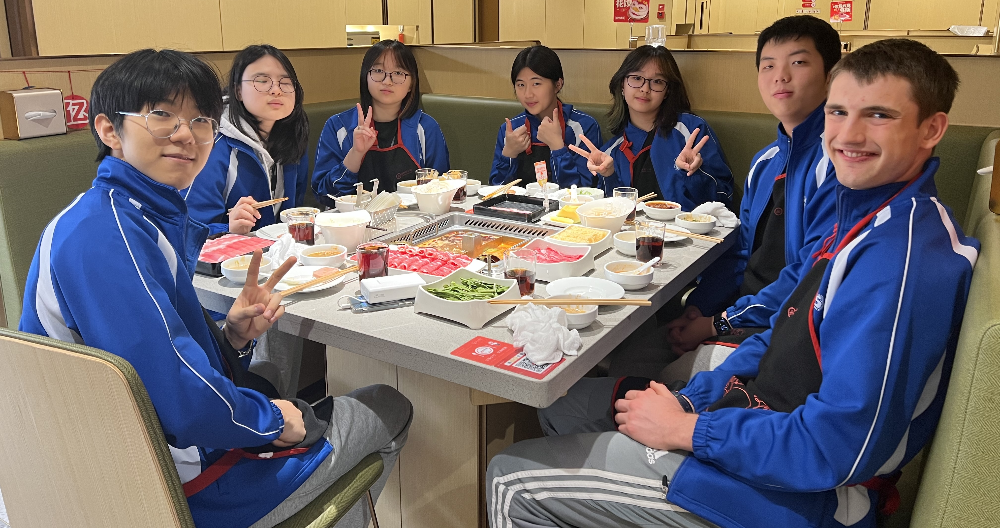

# 86832C

## Competition & Awards History

* 2023 TIS Robotics Challenge: Innovate Award, Semifinalist, [Skills 2nd Place](https://www.robotevents.com/robot-competitions/vex-robotics-competition/RE-VRC-23-1174.html#results-)
* 2023 ISB Robotics Scrimmage: Tournament Champion
* 2024 TIS Robotics Challenge: [Semifinalist](https://www.robotevents.com/robot-competitions/vex-robotics-competition/RE-VRC-23-2772.html#results-), [Skills 2nd Place](https://www.robotevents.com/robot-competitions/vex-robotics-competition/RE-VRC-23-2772.html#results-)

## Member History

### 2023-2024 Over Under:

<figure><figcaption>
86832C 2023-2024: (Left to right: Myungjung Lee, Sieun Park, Chloe Lee, Nan Jiang, Candy Wei, Samuel Yao, Silas Brock)
</figcaption></figure>

* Myungjung Lee
* Silas Brock
* Samuel Yao _(Semester 2)_
* Nan Jiang
* Candy Wei
* Chloe Lee
* Sieun Park

### 2022-2023 Spin Up:

<figure><figcaption>
86832C 2022-2023: (Left to right: Candy Wei, Nan Jiang, Samuel Yao, Asher Sevy, Myungjun Lee, Silas Brock)
</figcaption></figure>

* Myungjung Lee
* Silas Brock
* Asher Sevy
* Samuel Yao
* Nan Jiang
* Candy Wei

### 2021-2022 Tipping Point:

### 2019-2020 Tower Takeover:&#x20;

* Hannah Lu
* Justin Jeon
* Karan Rai
* Jay Cho
* James Lee
* Eric Xie
* Joonho Song

