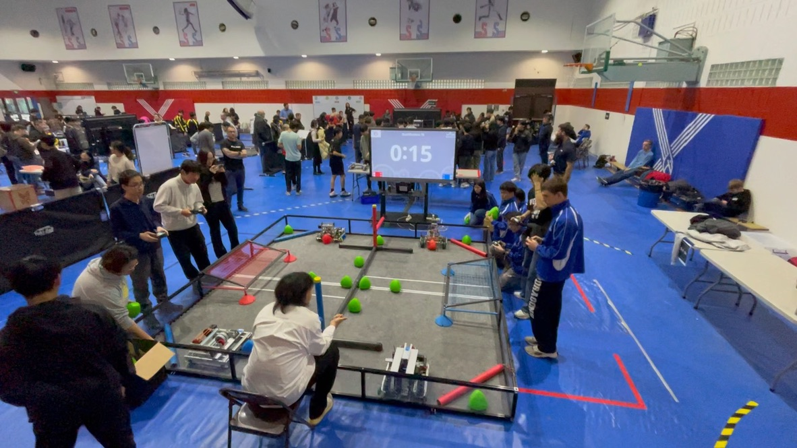

# APAC Robotics Documentation

## SASPX Trial APAC Tournament&#x20;

### Event Documents

The following documents were provided by the student organizers of the tournament after the tournament. The data provided is expected to be mostly accurate with the exception of the missing 3rd place round and 2nd Finals round.&#x20;


Team List



Qualification Match Results



Elimination Match Results



Qualification Rankings


### Match Recordings

Below are the recordings for certain matches. Match numbers, if available, are mentioned in the caption.

<figure><figcaption>
Qualification round ???
</figcaption></figure>

<figure><figcaption>
Finals round ???
</figcaption></figure>
