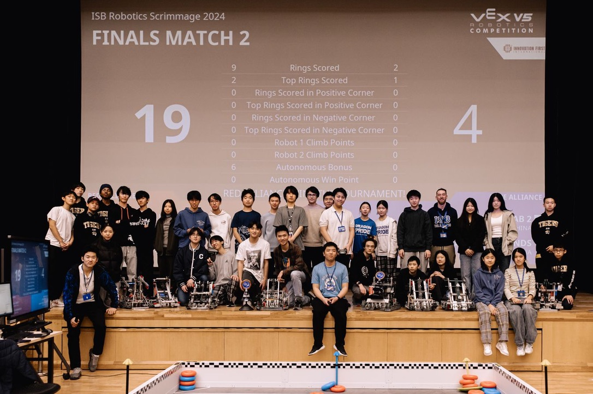

# High Stakes (12/7/2024)

<figure><figcaption>
ISB Robotics Scrimmage 2024 Group Photo
</figcaption></figure>

The ISB HS Robotics Club hosted a VRC scrimmage as the ISB ES Theatre, with participating teams from the International School of Beijing, Beijing City International School and the Western Academy of Beijing.&#x20;

Congratulations to 86832A and 86832B for becoming tournament champions!

Please contact Samuel Yao (yaoshisamuel@gmail.com) for further information inquiries about the ISB Robotics Scrimmage in 2024.&#x20;

### Event Documents









### Volunteer List

The HS Robotics Executive Team would like to thank all of the volunteers and team members who helped out during the event, including:

* Amanda Chang - Supervising Teacher
* Andrew Walton - Supervising Teacher
* Cindy Wu - Scorekeeper Referee
* Daryl Harkin - Event Partner/Supervising Teacher
* Emily Zhou - Pit Admin/Field Reset
* Jason Yang  - Master of Ceremonies (Emcee)
* Jayden Guan - Scorekeeper Referee
* Jia Lee - Pit Admin/Field Reset
* Patrick Young - Pit Admin/TM Operator
* Ryan Yao - Scorekeeper Referee
* Samuel Yao - Head Referee/Volunteer Coordinator/TM Operator
* Sophie Wang - Pit Admin/Field Reset
* Susan Su - Supervising Teacher
* William Pan - Pit Admin

The Executive Team would also like to thank BCIS for providing additional field and game elements for the scrimmage, ISB Theatre staff for live stream and media setup, and Sodexo for event setup and cleanup assistance. Without everyone who has helped and assisted us, including our student volunteers, adult volunteers, school staff and community members, this even would not have been possible.&#x20;

### Match Recordings

Some match recordings from the tournament are uploaded here (if available):



The final matches (F1 and F2) are linked below: (Videos by Mr. Walton)




