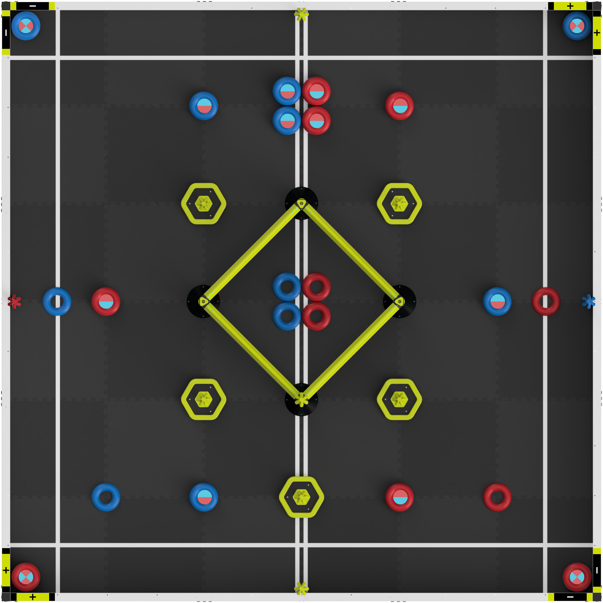

# Judging Quick Links

## IIWII Robotics Guide

The following GitBook is a useful resource explaining the many parts of the judging process, especially including the Engineering Design Notebook.


Link to the IIWII Robotics GitBook ([https://iiwii-robotics.gitbook.io/engineering-notebook](https://iiwii-robotics.gitbook.io/engineering-notebook))


## RECF Library

The RECF Library, as the official library containing information on Judging and all VEX competitions, is a useful reference source for introductions and comprehensive explanations for judging at VEX competitions.&#x20;


Link to RECF Library ([https://kb.roboticseducation.org/hc/en-us](https://kb.roboticseducation.org/hc/en-us))


## QNAPlus

This website is an optimized tool to help teams, referees, judges and more to navigate the Q\&A systems for V5RC, VIQRC and Judging to allow for easier navigation of the Q\&A system.&#x20;


Link to qnaplus ([https://qnapl.us/#/](https://qnapl.us/#/))


The GitHub Project for this website is linked here: [https://github.com/qnaplus](https://github.com/qnaplus)

## Purdue SIGBots (BLRS) Wiki

Being one of the core reference resources used by VEX Robotics enthusiasts worldwide, the Purdue SIGBots Wiki contains useful sections explaining the design process, digital notebook making on Notion and a copy of their Engineering Design Notebook that won the Design Award at the VEXU/VURC World Championship.&#x20;


Link to Purdue SIGBots Wiki ([https://wiki.purduesigbots.com/](https://wiki.purduesigbots.com/))


## Robot Notebooker Discord

## 9MotorGang

## Miscellaneous Links

Excellence Award Criteria Check: [https://bren.app/excellence/](https://bren.app/excellence/)

Referee FYI ( Minor violations record, for referees) [https://referee.fyi/](https://referee.fyi/)

Robomentors: worlds software for judging [https://robomentors.com/](https://robomentors.com/)

Jerrio Field Diagram (Exported):&#x20;

<figure><figcaption></figcaption></figure>
