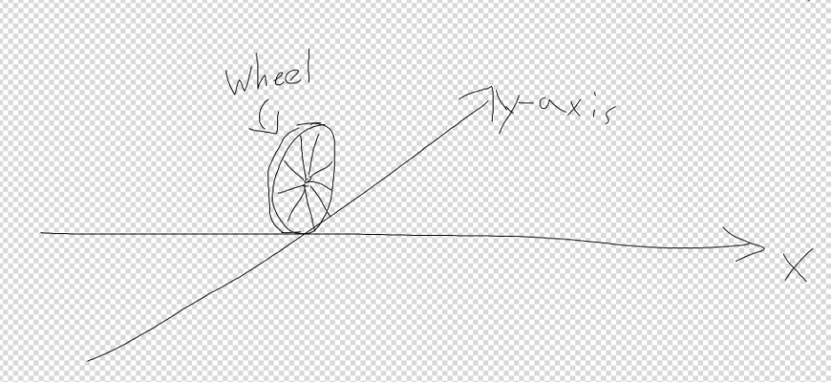

# Robot Movement Theory

In VEX HS Robotics, there is a 15-second autonomous period at the start of every match, where only the program is allowed to move the robot, i.e. no inputs are taken from the driver controllers. Furthermore, there is also a full 1-minute 45-second solo match (Referred to as programming skills or autonomous skills) where only your program drives the robot with no human inputs. These sections are the main challenges for the programmer on any team, as designing reliable, high-scoring autonomous routines is exceedingly challenging.&#x20;

In most teams (I estimate 90% of regular teams), an autonomous routine consists of time-based movements. Much like beginning computer science activities in block-based coding software like scratch, by making a mouse pointer move forward and so on, the robot follows set instructions which are spaced out by using time delays. &#x20;

While this method can work, it is generally extremely unreliable to the point of being unable to score past a minimum number of points in any routine. This is because the real world is not perfect, and any part of the robot will not function the same every run. As such, time-based systems may work for one run but not the other solely based on these external factors.&#x20;

In this section, I will lay out the foundations of advanced robot movement theory, which is used by every top-scoring team for their autonomous routines. As this is meant for the ISB VEX robotics team which consists mostly of 9th graders coming in without any or little experience with coding and an indifference towards math, I will try to explain things in a very basic way.&#x20;

## Unicycle Model

In robotics, we often need to model things as it allows us to make things simple for us humans to understand and build upon. The simplest wheeled robot is, in fact, a single rolling wheel. While not practical or possible in real life (it would be incredibly stupid to bring a single wheel to a vex competition), it actually models a lot of types of wheeled robots quite well.&#x20;

To begin, imagine a wheel on an infinite 2d plane, where the positive y-axis points upward and x points right.&#x20;

<figure><figcaption>
Wheel on a 2D plane (with Y and X-axis)
</figcaption></figure>

Now, consider the front of the wheel as the “head” of the wheel, and the direction that it is pointing at an angle of $$0°$$degrees (initially). For me, I like to consider that when the wheel turns right, the angle increases, and when it turns left, it decreases.&#x20;

Finally, the wheel spontaneously starts spinning at a constant rate. It rolls on the ground, forward. Now, imagine this happening and observe the center of the wheel. It travels forward at a constant speed – call this speed $$v_{linear}$$. If the wheel travels, say 3 seconds, then the final position is just the coordinate $$(0, 3 \times v_{linear})$$ on the 2d plane. This is pretty easy to understand. However, note that we have just derived the location of the robot, from its initial coordinate position of $$(0, 0)$$, just from its speed and the time it spent traveling. This is, in fact, what we aim to achieve in a more general case.&#x20;

Now, imagine that the wheel spins at the same constant speed. However, the angle that the robot heads in also increases at a constant rate. Imagine this in your head, you realize that the robot moves forward but also curves to the right (positive x direction). Now, calculating the final position of the robot from its speed is no longer as trivial. However, if we observe closely, we realize that the path the wheel is following looks like a circle. Using this fact, we can start to break out the math.&#x20;

<figure><figcaption></figcaption></figure>

Initially, the robot is at a heading of $$0°$$, but it is increasing at a steady rate of, say, $$𝜔$$ degrees per second. As such, the change in the wheel’s heading during a time $$∆𝑡$$ seconds is just $$𝜔\times∆𝑡$$. We call this $$∆𝜃$$, the change in heading. (In most contexts, $$∆$$ before a variable means the change in the variable). From the previous paragraph, we know that the path the wheel traces out follows a part of a circle. If we draw out this part, it looks like a pizza slice, which is illustrated above. Now, in fact, the angle made by the two arms of the pizza slice is actually equal to the change in our heading $$∆𝜃$$. Furthermore, each of the arms is equal in length (because they are radii), and has length $$𝑟$$. From this, we can start to work out our position.&#x20;

We can start by calculating the radius of the circle. While the robot’s final position cannot be straightforwardly calculated using the linear velocity, the length of the arc of the circle that the wheel follows actually is equal to $$∆𝑡\times𝑣_{𝑙𝑖𝑛𝑒𝑎𝑟}$$. From math class, you might have learned that the following is true:&#x20;

$$
arc \space length = 2\pi r \times \frac{angle \space in \space degrees}{360}
$$

Rearranging this, we get:

$$
\frac{arc \space length}{2\pi}\times \frac{360}{angle \space in \space degrees}=r
$$

Which, by plugging in the values we got above, we get:

$$
r=\frac{\Delta \times v_{linear}}{2\pi}\times \frac{360}{\Delta\theta}
$$

$$
=\frac{\Delta t \times v_{linear} \times 180}{\pi \times \Delta t \times \omega}
$$

$$
= \frac{v_{linear}}{\omega} \times \frac{180}{\pi}
$$

In fact, if we consider all angles to be in radians, we can ignore the last $$\frac{180}{\pi}$$, simplifying the equation down to:

$$
r=\frac{v_{linear}}{\omega}
$$

From now on, because it is more convenient and conventional, I will consider all rotational and angular units to be in radians. (If you don’t know what a radian is, I suggest searching it up).&#x20;

We can then proceed by using the formula for the length of the chord of a circle (a line passing through two points on the circle) given the radius and angle made by the two radius-es connecting the two points to the center of the circle. The formula is:&#x20;

$$
chord \space length = \frac{1}{2} r^2 \sin(angle)
$$

Here, sin(angle) is the angle fed into the sine function, which if you don’t know, is the funny-looking oscillating graph (don’t worry too much about it for now, you will learn it later in math class). Using this, we can calculate the length of the red line on the diagram above.

$$
chord \space length = \frac{1}{2} (\frac{v_{linear}}{\omega})^2 \sin(\omega \times \Delta t)
$$
